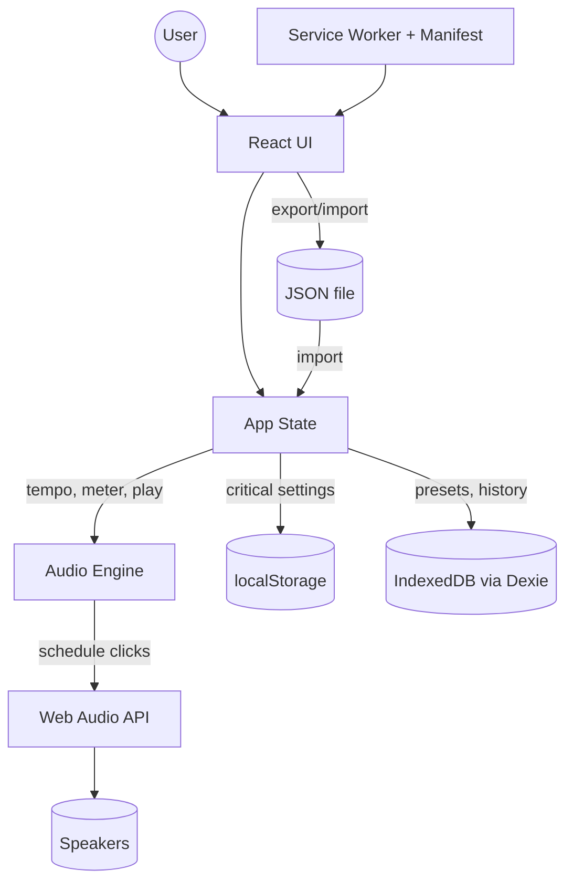

# Architecture

**Last Updated:** 2026-01-04

## Overview

Metronome is a progressive web application (PWA) built with React and TypeScript that provides accurate audio timing using the Web Audio API. The application follows a unidirectional data flow pattern where React manages UI state, which controls an independent audio engine responsible for precise timing.

## System Overview

The following diagram illustrates how components interact within the application:

**Data Flow:**

- User interactions update React state
- State changes propagate to the Audio Engine
- Audio Engine schedules precise clicks via Web Audio API
- Critical settings persist to localStorage
- Presets and history stored in IndexedDB
- Export/import provides data portability
- Service Worker enables offline functionality

## Key Components

### Audio Engine

_File: `src/utils/audioEngine.ts` (placeholder link - will be updated when implemented)_

The AudioEngine is the core timing system responsible for:

- Scheduling metronome clicks using Web Audio API's `AudioContext.currentTime`
- Look-ahead scheduling (schedule ~100ms ahead, tick every ~25ms)
- Providing beat callbacks for UI synchronization
- Supporting tempo range of 30-300 BPM
- Supporting time signatures with 1-12 beats per bar
- Accenting the first beat of each bar (pitch or amplitude)

**Key Implementation Details:**

- Uses `setTimeout`/`setInterval` for the scheduler loop (ticks every 25ms)
- Uses `AudioContext.currentTime` for precise audio scheduling (not JS timers)
- Schedules notes that fall within the look-ahead window (currentTime + 100ms)
- Provides callbacks to React for visual beat indicators (acknowledging potential jitter)

See [AUDIO_ENGINE.md](AUDIO_ENGINE.md) for detailed timing rationale.

### App State Management

_File: `src/App.tsx` or `src/store/` (placeholder link - will be updated when implemented)_

Application state includes:

- **Playback state:** playing/stopped
- **Tempo:** 30-300 BPM (default: 120)
- **Time signature:** beats per bar (1-12, default: 4)
- **Volume:** 0-100% (default: 80%)
- **Presets:** saved tempo/time signature combinations

State flows unidirectionally:

1. User interacts with UI
2. React state updates
3. State changes propagate to AudioEngine
4. AudioEngine schedules audio accordingly
5. Beat callbacks update UI indicators

### Persistence Layer

The application uses a tiered storage strategy:

#### localStorage

_File: `src/utils/storage.ts` (placeholder link - will be updated when implemented)_

Critical settings stored in localStorage:

- Last used tempo
- Last used time signature
- Volume setting

#### IndexedDB (via Dexie)

_Schema: `src/db/schema.ts` (placeholder link - will be updated when implemented)_

Used for:

- Preset configurations
- Optional practice history

#### Export/Import

_Implementation: `src/utils/export.ts` (placeholder link - will be updated when implemented)_

JSON export/import functionality provides:

- Cross-device data portability
- Backup mechanism
- iOS compatibility (where IndexedDB may be cleared)

See [STORAGE.md](STORAGE.md) for storage strategy details.

### Progressive Web App (PWA)

_Configuration: `vite.config.ts` and `public/manifest.json` (placeholder links)_

PWA features:

- Service Worker for offline functionality
- App manifest for installability
- Icons for home screen (192x192, 512x512, apple-touch-icon)
- Works offline after first load

### UI Components

_Directory: `src/components/` (placeholder link - will be updated when implemented)_

Key UI components:

- **TempoControl:** Tempo slider/input and tap tempo button
- **TimeSignatureControl:** Beats per bar selector
- **PlaybackControls:** Start/stop button
- **BeatIndicator:** Visual beat feedback (synchronized to audio callbacks)
- **VolumeControl:** Master volume slider
- **PresetManager:** Save/load/delete preset configurations

## Design Principles

### Audio Timing Accuracy

Audio scheduling is completely independent of UI rendering. JavaScript timers are used only for the scheduler loop; all audio events are scheduled using `AudioContext.currentTime` to prevent jitter from UI updates or browser throttling.

### Mobile-First Design

- Touch targets sized for finger interaction (minimum 44x44px)
- Responsive layout that works from mobile to desktop
- Large, clear controls optimized for touch

### Progressive Enhancement

- Core functionality (play/stop with basic controls) works immediately
- Advanced features (presets, history) require IndexedDB
- Export/Import provides fallback for iOS and data portability

### Documentation as Code

- All architectural decisions documented with line-linked references
- Documentation updated incrementally as code stabilizes
- Mermaid diagrams maintained alongside implementation

### Styling System

The application uses Tailwind CSS v4 for styling:

- **Entry Point:** [src/index.css](../src/index.css) - Imports Tailwind CSS base styles
- **Configuration:** [vite.config.ts](../vite.config.ts) - Tailwind Vite plugin integration
- **Approach:** Utility-first CSS with Tailwind classes applied directly to components
- **Mobile-First:** All layouts designed mobile-first with responsive breakpoints
- **Touch Targets:** Minimum 44x44px for all interactive elements

The Tailwind Vite plugin enables:

- Hot Module Replacement (HMR) for instant style updates
- Automatic CSS optimization and tree-shaking in production
- PostCSS processing with autoprefixer

## Technology Stack

- **Framework:** React 18+ with TypeScript
- **Build Tool:** Vite 5+
- **Styling:** Tailwind CSS v4
- **Audio:** Web Audio API (native)
- **Database:** Dexie.js (IndexedDB wrapper)
- **PWA:** vite-plugin-pwa
- **Package Manager:** pnpm

## Development Workflow

1. **Local Development:** `pnpm run dev` (port 5173)
2. **Linting:** `pnpm run lint`
3. **Type Checking:** TypeScript strict mode enabled
4. **Build:** `pnpm run build`
5. **Preview:** `pnpm run preview` (test production build locally)
6. **CI/CD:** GitHub Actions (see `.github/workflows/`)

## Browser Compatibility

Target browsers:

- Chrome/Edge 90+ (Chromium)
- Firefox 88+
- Safari 14+ (iOS 14+)

All target browsers support:

- Web Audio API
- Service Workers
- IndexedDB
- ES2020+ features

## Performance Considerations

- Audio scheduling runs in look-ahead loop independent of UI
- React re-renders do not affect audio timing
- Service Worker caches assets for instant offline loading
- Minimal dependencies to keep bundle size small
