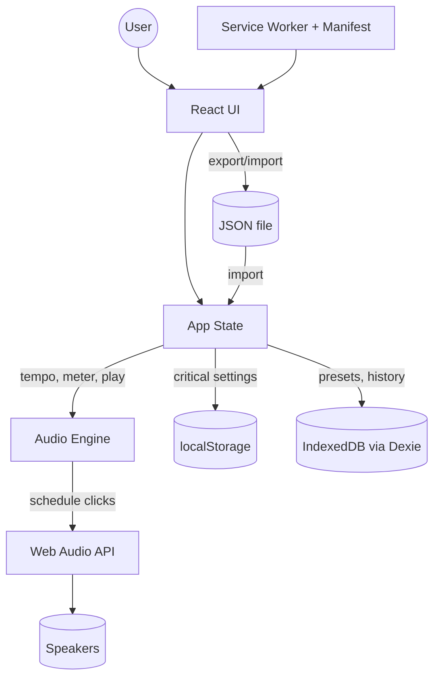

# Architecture

**Last Updated:** 2026-01-06

## Overview

Metronome is a progressive web application (PWA) built with React and TypeScript that provides accurate audio timing using the Web Audio API. The application follows a unidirectional data flow pattern where React manages UI state, which controls an independent audio engine responsible for precise timing.

## System Overview

The following diagram illustrates how components interact within the application:

**Data Flow:**

- User interactions update React state
- State changes propagate to the Audio Engine
- Audio Engine schedules precise clicks via Web Audio API
- Critical settings persist to localStorage
- Presets and history stored in IndexedDB
- Export/import provides data portability
- Service Worker enables offline functionality

## Key Components

### Audio Engine

_File: [src/utils/audioEngine.ts](../src/utils/audioEngine.ts)_

The AudioEngine is the core timing system responsible for:

- Scheduling metronome clicks using Web Audio API's `AudioContext.currentTime`
- Look-ahead scheduling (schedule ~100ms ahead, tick every ~25ms)
- Providing beat callbacks for UI synchronization
- Supporting tempo range of 30-900 BPM (UI limits 30-600)
- Supporting time signatures with 1-99 beats per bar and all power-of-2 beat units
- Primary accent on beat 1 and secondary accents for compound meters
- Master volume control via gain node (0.0-1.0)

**Key Implementation Details:**

- Uses `setTimeout`/`setInterval` for the scheduler loop (ticks every 25ms)
- Uses `AudioContext.currentTime` for precise audio scheduling (not JS timers)
- Schedules notes that fall within the look-ahead window (currentTime + 100ms)
- Provides callbacks to React for visual beat indicators (acknowledging potential jitter)
- Master gain node connects to destination for global volume control

See [AUDIO_ENGINE.md](AUDIO_ENGINE.md) for detailed timing rationale.

### App State Management

_File: [src/App.tsx](../src/App.tsx)_

Application state includes:

- **Playback state:** playing/stopped
- **Tempo:** 30-600 BPM (default: 120)
- **Time signature:** numerator/denominator (default: 4/4)
- **Tempo linking:** Optional BPM adjustment when beat unit changes
- **Volume:** 0.0-1.0 (default: 0.5)
- **Dark mode:** Light/dark theme preference
- **Current beat:** Visual beat indicator position (1-indexed)
- **Tap tempo:** Timing data for tap-based tempo detection

State flows unidirectionally:

1. User interacts with UI
2. React state updates
3. State changes propagate to AudioEngine
4. AudioEngine schedules audio accordingly
5. Beat callbacks update UI indicators

### Persistence Layer

_File: [src/utils/storage.ts](../src/utils/storage.ts)_

The application uses a tiered storage approach:

**localStorage** ([src/utils/storage.ts](../src/utils/storage.ts)) - Critical settings persist automatically:

- Tempo, time signature, volume, dark mode, link tempo preference
- Settings load on app initialization using lazy state initialization
- All changes saved immediately to localStorage
- Graceful fallback to defaults if localStorage unavailable

**Export/Import JSON** ([src/utils/storage.ts:135-204](../src/utils/storage.ts#L135-L204)) - Data portability:

- Export current settings to dated JSON file
- Import settings from JSON with validation
- Provides backup and sharing functionality
- UI integration via buttons at bottom of app

**IndexedDB (Future)** - For presets and history:

- Not yet implemented
- Will use Dexie.js wrapper
- See [STORAGE.md](STORAGE.md) for implementation plan

See [STORAGE.md](STORAGE.md) for detailed storage documentation.

### Progressive Web App (PWA)

PWA implementation pending. See [DEVELOPMENT_PLAN.md](DEVELOPMENT_PLAN.md) Phase 7.

## Design Principles

### Audio Timing Accuracy

Audio scheduling is completely independent of UI rendering. JavaScript timers are used only for the scheduler loop; all audio events are scheduled using `AudioContext.currentTime` to prevent jitter from UI updates or browser throttling.

### Mobile-First Design

- Touch targets sized for finger interaction (minimum 44x44px)
- Responsive layout that works from mobile to desktop
- Large, clear controls optimized for touch

### Progressive Enhancement

- Core functionality (play/stop with basic controls) works immediately
- Advanced features (presets, history) require IndexedDB
- Export/Import provides fallback for iOS and data portability

### Documentation as Code

- All architectural decisions documented with line-linked references
- Documentation updated incrementally as code stabilizes
- Mermaid diagrams maintained alongside implementation

### User Interface

_File: [src/App.tsx](../src/App.tsx)_

The UI provides comprehensive control over metronome functionality:

**Core Controls:**

- **Play/Stop Button:** Large, prominent button for starting/stopping playback
- **Tempo Controls:** Increment/decrement buttons, slider (30-600 BPM), and numeric display
- **Time Signature:** Increment/decrement buttons for numerator and denominator with keyboard support
- **Beat Indicator:** Visual display of current beat with accent colors (red=primary, green=secondary, blue=regular)

**Advanced Features:**

- **Tap Tempo:** [src/App.tsx:198-240](../src/App.tsx#L198-L240) - Tap repeatedly to set tempo
  - Calculates average BPM from last 8 taps
  - Auto-resets after 2 seconds of inactivity
  - Visual feedback shows tap count
- **Volume Control:** [src/App.tsx:617-700](../src/App.tsx#L617-L700) - Slider with mute button and percentage display
  - Interactive volume icon (muted/low/high states)
  - Range: 0-100%
- **Tempo Linking:** Toggle to adjust BPM proportionally when beat unit changes
- **Dark Mode:** [src/App.tsx:256-289](../src/App.tsx#L256-L289) - Theme toggle with smooth transitions
  - Persists theme preference (implementation pending)
  - Smooth color transitions for all UI elements

**Visual Grouping:**

- Compound time signatures (6/8, 9/8, 12/8) display beats in groups of 3
- Simple time signatures show all beats in a single row
- Visual separation helps users understand beat structure

### Styling System

The application uses Tailwind CSS v4 for styling:

- **Entry Point:** [src/index.css](../src/index.css) - Imports Tailwind CSS base styles
- **Configuration:** [vite.config.ts](../vite.config.ts) - Tailwind Vite plugin integration
- **Approach:** Utility-first CSS with Tailwind classes applied directly to components
- **Mobile-First:** All layouts designed mobile-first with responsive breakpoints
- **Touch Targets:** Minimum 44x44px for all interactive elements

**Custom Animations:** [src/index.css](../src/index.css)

- Beat pulse animation for active beat indicator
- Value change animation for time signature updates
- Smooth button and slider transitions
- Custom range slider styling with gradient thumbs
- Respects `prefers-reduced-motion` for accessibility

The Tailwind Vite plugin enables:

- Hot Module Replacement (HMR) for instant style updates
- Automatic CSS optimization and tree-shaking in production
- PostCSS processing with autoprefixer

## Technology Stack

- **Framework:** React 18+ with TypeScript
- **Build Tool:** Vite 5+
- **Styling:** Tailwind CSS v4
- **Audio:** Web Audio API (native)
- **Database:** Dexie.js (IndexedDB wrapper)
- **PWA:** vite-plugin-pwa
- **Package Manager:** pnpm

## Development Workflow

1. **Local Development:** `pnpm run dev` (port 5173)
2. **Linting:** `pnpm run lint`
3. **Type Checking:** TypeScript strict mode enabled
4. **Build:** `pnpm run build`
5. **Preview:** `pnpm run preview` (test production build locally)
6. **CI/CD:** GitHub Actions (see `.github/workflows/`)

## Browser Compatibility

Target browsers:

- Chrome/Edge 90+ (Chromium)
- Firefox 88+
- Safari 14+ (iOS 14+)

All target browsers support:

- Web Audio API
- Service Workers
- IndexedDB
- ES2020+ features

## Performance Considerations

- Audio scheduling runs in look-ahead loop independent of UI
- React re-renders do not affect audio timing
- Service Worker caches assets for instant offline loading
- Minimal dependencies to keep bundle size small
