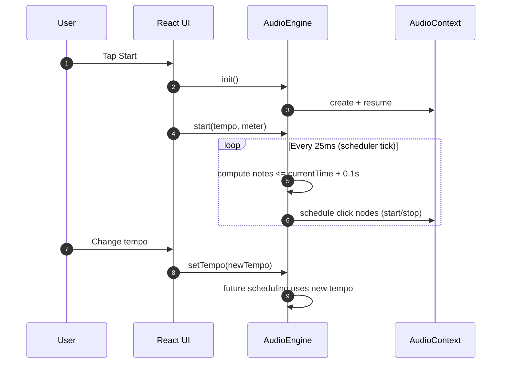
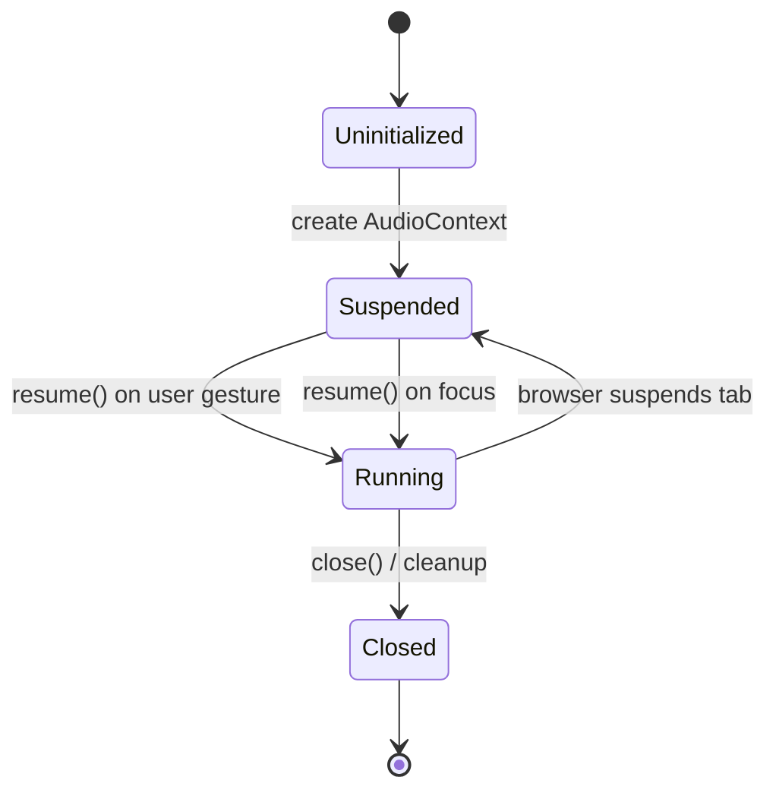

# Audio Engine

**Last Updated:** 2026-01-06

## Overview

The AudioEngine is responsible for generating precise, stable metronome clicks using the Web Audio API. It employs a look-ahead scheduling pattern to ensure timing accuracy regardless of UI updates, browser throttling, or background tab behavior.

## Core Problem: JavaScript Timer Jitter

JavaScript timers (`setTimeout`, `setInterval`, `requestAnimationFrame`) are inherently imprecise:

1. **Resolution Limitations:** JS timers have ~4-10ms resolution depending on browser and context
2. **Main Thread Blocking:** UI updates, layout calculations, and other JS execution delay timer callbacks
3. **Browser Throttling:** Background tabs may throttle timers to 1000ms or more
4. **Frame Sync Issues:** `requestAnimationFrame` is tied to display refresh (16.67ms @ 60fps), creating quantization

**Example:** A 120 BPM metronome requires clicks every 500ms. If each click is scheduled using `setTimeout(playClick, 500)`, accumulated jitter can make the timing drift by 10-50ms or more, which is easily audible.

## Solution: Look-Ahead Scheduling with AudioContext

The Web Audio API provides `AudioContext.currentTime`, a high-precision clock that increments in audio sample time. By scheduling audio events ahead of time using this clock, we decouple audio timing from JavaScript execution timing.

### Look-Ahead Scheduler Pattern

The following sequence diagram illustrates the look-ahead scheduling pattern:



The scheduler runs in two concurrent loops:

#### 1. Scheduler Tick (JavaScript Timer)

_Implementation: [src/utils/audioEngine.ts:172-188](src/utils/audioEngine.ts#L172-L188) (schedule method)_

```text
Every 25ms:
  - Check currentTime
  - Schedule any beats that fall within [currentTime, currentTime + 100ms]
  - Track next beat time
```

**Constants:**

- **Tick Interval:** 25ms (scheduler loop frequency)
  - _Link: [src/utils/audioEngine.ts:19](src/utils/audioEngine.ts#L19)_
- **Look-Ahead Time:** 100ms (scheduling window)
  - _Link: [src/utils/audioEngine.ts:16](src/utils/audioEngine.ts#L16)_

The 25ms tick interval is frequent enough to catch beats with margin, but not so frequent that it wastes CPU.

#### 2. Audio Event Scheduling (Web Audio API)

_Implementation: [src/utils/audioEngine.ts:192-220](src/utils/audioEngine.ts#L192-L220) (scheduleBeat method)_

```text
For each beat in the look-ahead window:
  - Create OscillatorNode
  - Set frequency (higher for beat 1, lower for other beats)
  - Set gain (accent on beat 1)
  - Schedule start(beatTime) and stop(beatTime + 0.05)
```

Audio nodes are scheduled using `AudioContext.currentTime` offsets, ensuring sample-accurate timing independent of when the JavaScript code runs.

### Why This Works

- **Decoupling:** Audio scheduling happens in the audio thread, not the main thread
- **Look-Ahead Buffer:** The 100ms window absorbs JavaScript jitter
- **Sample Accuracy:** Web Audio API schedules events at the sample level (typically 44.1kHz or 48kHz)

Even if a scheduler tick is delayed by 20ms due to UI work, it doesn't matter—the audio events are already scheduled 100ms ahead.

## Implementation Details

### AudioContext Lifecycle

_Implementation: [src/utils/audioEngine.ts:89-109](src/utils/audioEngine.ts#L89-L109) (init method), [src/utils/audioEngine.ts:161-170](src/utils/audioEngine.ts#L161-L170) (dispose method)_

The AudioContext follows a specific lifecycle with state transitions:



**State Transitions:**

1. **Creation:** `new AudioContext()` when user first interacts (browser autoplay policy)
2. **Resume:** Call `audioContext.resume()` on user gesture (required by browsers)
3. **Cleanup:** Call `audioContext.close()` when done

**Note:** The metronome continues playing even when the browser tab loses focus or is backgrounded. This is intentional behavior - a metronome should keep time consistently regardless of window visibility.

### Click Sound Synthesis

_Implementation: [src/utils/audioEngine.ts:241-285](src/utils/audioEngine.ts#L241-L285) (scheduleBeat method)_

Each click is generated using:

- **OscillatorNode:** Short sine wave burst
- **GainNode:** Volume control and envelope (attack/release)
- **Accent Implementation:**
  - Primary accent (beat 1): 950 Hz
  - Secondary accent (compound meters): 875 Hz
  - Regular beats: 800 Hz

Duration: 50ms burst with exponential decay envelope

### Tempo and Time Signature Support

**Tempo Range:** 30–900 BPM (UI limits to 30-600 BPM)

- Formula: `beatInterval = 60 / tempo` (in seconds)
- 30 BPM = 2 seconds per beat
- 900 BPM = 0.067 seconds per beat

**Time Signature:** 1–99 beats per bar, power-of-2 beat units (1, 2, 4, 8, 16, 32, 64)

- Tracks current beat number (1-based)
- Primary accent on beat 1
- Secondary accents for compound meters (6/8, 9/8, 12/8)
- Wraps to 1 after reaching beats-per-bar

### Beat Callbacks for UI Synchronization

_Implementation: [src/utils/audioEngine.ts:156-159](src/utils/audioEngine.ts#L156-L159) (onBeat method), [src/utils/audioEngine.ts:207-218](src/utils/audioEngine.ts#L207-L218) (callback invocation)_

The engine provides a callback fired on each beat for UI updates (e.g., beat indicator flash). This callback runs in JavaScript time and may have visual jitter, but does not affect audio accuracy.

```typescript
engine.onBeat = (beatNumber: number) => {
  // Update UI beat indicator
  // This may lag slightly due to main thread work
}
```

**Important:** The UI callback is informational only. Audio timing is independent.

### Parameter Changes During Playback

When tempo or time signature changes while playing:

- **No Audio Glitch:** Current look-ahead schedule completes
- **Smooth Transition:** Next scheduling tick uses new parameters
- **Beat Continuity:** Beat counter optionally resets or continues based on UI semantics

## Constants Reference

| Constant                     | Value   | Purpose                         | Location                                                    |
| ---------------------------- | ------- | ------------------------------- | ----------------------------------------------------------- |
| `SCHEDULE_AHEAD_TIME`        | 100ms   | Scheduling window size          | [src/utils/audioEngine.ts:16](src/utils/audioEngine.ts#L16) |
| `SCHEDULER_INTERVAL`         | 25ms    | Frequency of scheduler loop     | [src/utils/audioEngine.ts:19](src/utils/audioEngine.ts#L19) |
| `CLICK_DURATION`             | 50ms    | Length of each click sound      | [src/utils/audioEngine.ts:22](src/utils/audioEngine.ts#L22) |
| `ACCENT_FREQUENCY`           | 950 Hz  | Frequency for beat 1            | [src/utils/audioEngine.ts:28](src/utils/audioEngine.ts#L28) |
| `ACCENT_SECONDARY_FREQUENCY` | 875 Hz  | Frequency for secondary accents | [src/utils/audioEngine.ts:31](src/utils/audioEngine.ts#L31) |
| `REGULAR_FREQUENCY`          | 800 Hz  | Frequency for regular beats     | [src/utils/audioEngine.ts:34](src/utils/audioEngine.ts#L34) |
| `MIN_TEMPO`                  | 30 BPM  | Minimum supported tempo         | [src/utils/audioEngine.ts:37](src/utils/audioEngine.ts#L37) |
| `MAX_TEMPO`                  | 900 BPM | Maximum supported tempo         | [src/utils/audioEngine.ts:38](src/utils/audioEngine.ts#L38) |
| `MIN_BEATS_PER_BAR`          | 1       | Minimum time signature          | [src/utils/audioEngine.ts:41](src/utils/audioEngine.ts#L41) |
| `MAX_BEATS_PER_BAR`          | 99      | Maximum time signature          | [src/utils/audioEngine.ts:42](src/utils/audioEngine.ts#L42) |

## Testing Audio Accuracy

To validate timing accuracy:

1. **Metronome Comparison:** Compare against a hardware metronome or trusted software
2. **Recording Analysis:** Record output and analyze inter-click intervals in a DAW
3. **Stress Testing:** Run with heavy UI load (animations, complex updates) to ensure no audio drift
4. **Background Tab:** Verify timing remains accurate when tab is backgrounded

Expected result: Inter-click intervals should vary by less than ±1ms even under load.

## Browser Support

The look-ahead scheduling pattern works in all browsers supporting Web Audio API:

- Chrome/Edge 35+
- Firefox 25+
- Safari 14+ (iOS and macOS)

## References

- [Web Audio API Scheduling](https://www.html5rocks.com/en/tutorials/audio/scheduling/)
- [AudioContext.currentTime MDN](https://developer.mozilla.org/en-US/docs/Web/API/BaseAudioContext/currentTime)
- [Chris Wilson's A Tale of Two Clocks](https://web.dev/audio-scheduling/)

## Future Enhancements

- **Subdivisions:** 8th notes, triplets, etc.
- **Customizable Sounds:** User-provided samples via AudioBuffer
- **Polyrhythms:** Multiple simultaneous time signatures
